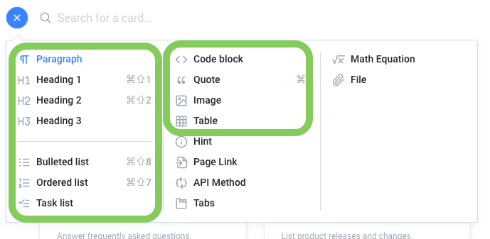

# Guide for writers

## How to write

Contents of this GitBook are packaged into Suite by a custom script that is based on a few assumptions about structure of the content.

### Groups are for locales

We support localization of the content by having a group for each locale. The groups should be named by corresponding  [ISO 639-1 2-letter code.](https://www.wikiwand.com/en/List\_of\_ISO\_639-1\_codes)

Localised variants of a single page are paired by the **slugs** which can be set in the "three dot" menu of each page. For nested pages the slugs must match on all levels.\
\
For example, if you want to write a czech translation for english page with slug `bitcoin` that is under a page with slug `coins` you must create a group named `cs` containing a page with slug `coins` containing a page with slug `bitcoin`. Only then it will be recognised as a translation of the english page. The title and the content can be altered freely.

### English is the canonical version

English locale defines the content structure. All other locales can only provide translations of english pages but they can't define their own pages.

This means that any non-enlgish page that doesn't have a slug matching slug of some english page won't be displayed in Suite.

### Categories can't hold content

**Categories are pages that have sub-pages**. We do not allow categories to hold content on their own. Categories only serve to organise the conent which must be put in leaf pages -- that is pages without children.

### Not all types of rich content are supported

As of now only these elements are supported:

## How to publish

The contents of this GitBook are packaged with each release of Suite applicaiton. The version is controlled from within Suite's codebase. To propagate your latest changes to the next relase ask Suite dev team to update the `GB_REVISION` configuration constant in the `suite-data` package.
